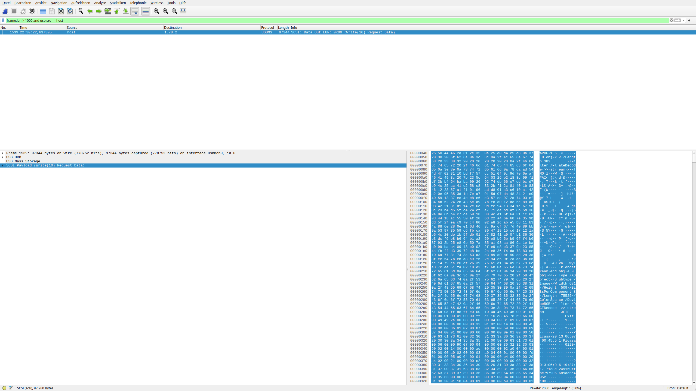

# prism - Writeup

We are given a Wireshark capture file that contains USB traffic.
The traffic from a storage device.
Because the challenge description asks whether data was exfiltrated, we look for traffic that originates from the host and goes to the device.
Also, we filter for frames that contain more than 1000 bytes of data.
We are left with a single package.

Looking at the payload of the package, we can see that it starts with `%PDF-`.
This is the [pdf magic number](https://en.wikipedia.org/wiki/List_of_file_signatures), so we can assume that the package contains a PDF file.
We can extract the payload from the package and save it to a file by clicking on the payload so that it is marked as selected and then do `File -> Export Packet Bytes`.
We save the file as `prism.pdf` and open it.
The file contains the [front slide of the secret PRISM presentation](https://upload.wikimedia.org/wikipedia/commons/b/bd/Cover_slide_of_PRISM.jpg) leaked by Edward Snowden.
In the bottom right corner, we can read the flag.

